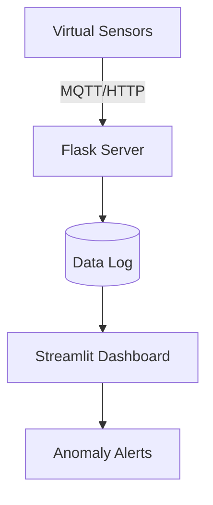

# 🚀 SmartEdge Sim - IoT Inventory Simulator

[](https://www.python.org/)
[](https://flask.palletsprojects.com/)
[](https://streamlit.io/)

A complete IoT simulation platform with virtual edge devices, AI anomaly detection, and real-time dashboard - perfect for embedded systems and IoT learning!

## 🌟 Features

- 🏭 **Virtual IoT Devices** - Simulate multiple inventory sensors
- 🧠 **Edge AI** - Detect abnormal inventory drops
- 📊 **Live Dashboard** - Streamlit visualization with historical charts
- 🔄 **Restock Control** - Manual inventory reset button
- ☁️ **Cloud-Ready** - Flask backend with REST API

## 🏗 System Architecture



## 🛠️ Tech Stack

| Component      | Technology                        |
|----------------|-----------------------------------|
| Simulation     | Python (random, time)             |
| Edge AI        | scikit-learn (basic thresholding) |
| Backend        | Flask (Python)                    |
| Dashboard      | Streamlit                         |
| Communication  | HTTP/REST                         |

## 🚀 Getting Started

### Prerequisites
- Python 3.11+
- Git

### Installation
```bash
git clone https://github.com/yourusername/smartedge_sim.git
cd smartedge_sim
pip install -r requirements.txt
```

### Running the System

- Start the backend:
  ```bash
  python backend/server.py
  ```
- Run the simulation:
  ```bash
  python main.py
  ```
- Launch dashboard:
  ```bash
  streamlit run dashboard/dashboard.py
  ```

## 📸 Screenshots

- Dashboard View
  
